# Localization Editor for Chrome

Trong thiết kế của ứng dụng web hoặc mobile của trung tâm, đa ngôn ngữ được định hướng là một tính năng cơ bản với các mục tiêu:

- Dễ dàng chỉnh sửa nội dung hiển thị / label trên giao diện theo ý khách hàng mong muốn.
- Dễ dàng chỉnh sửa nội dung hiển thị khi có yêu cầu thay đổi mà không ảnh hưởng đến logic / nghiệp vụ của ứng dụng
- Hướng tới cung cấp tiếng Anh là một ngôn ngữ cơ bản trong ứng dụng (mặc định vẫn là tiếng Việt) để phát triển ra quốc tế

Dựa trên cơ sở đa ngôn ngữ đã được thiết lập trong tất cả các dự án mobile/frontend, ta xây dựng công cụ **Localization editor** để hỗ trợ anh/chị/em BA / developer / tester / design có thể tương tác với thiết kế đa ngôn ngữ của ứng dụng một cách thuận tiện nhất.

Công cụ sẽ có những tính năng sau:

- Xuất text nodes từ file thiết kế Figma ra code
- Quản lý danh sách server Azure Devops
- Mở file từ Azure Devops để chỉnh sửa
- Mở file từ local để chỉnh sửa
- Import / Export excel

## Cài đặt

Hiện tại, công cụ được viết dưới dạng Chrome extension và đã có phiên bản đầu tiên:

[https://chrome.google.com/webstore/detail/localization-editor/eepapdeoidmlaihgncfaphiccekeghjn?hl=en&authuser=0](https://chrome.google.com/webstore/detail/localization-editor/eepapdeoidmlaihgncfaphiccekeghjn?hl=en&authuser=0)

Anh/chị có thể truy cập đường dẫn trên và cài đặt trực tiếp vào trình duyệt Chrome (hoặc Edge, ...) của mình. Sau khi cài đặt, anh chị có thể pin extension lên thanh taskbar của trình duyệt để dễ dàng sử dụng:

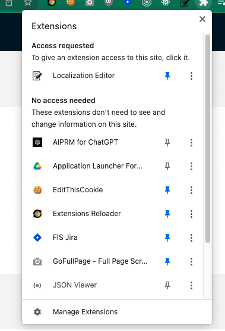

## Xuất các text label trong thiết kế Figma ra code

Ý tưởng: Các label hiển thị đã được người thiết kế làm trong Figma và Figma cung cấp đầy đủ các API để đọc file một cách dễ dàng. Vậy nếu ta thiết lập một số quy tắc thì có thể xuất ra code trực tiếp nhằm đạt được các lợi ích sau:

- Giảm thiểu công sức cho developer phải viết code phần ngôn ngữ
- Quy tắc hóa việc thiết kế cũng giúp việc thiết kế được chuẩn hóa và dễ dàng quản lý hơn, đạt được hiệu quả về lâu dài.

### Cấu hình API Key

Để có thể xuất code JSON từ Figma, anh chị cần tạo API Key cho Figma. Nội dung này đã được tài liệu hóa trong Figma nên phần này sẽ chỉ dẫn link hướng dẫn từ tài liệu chính thức của Figma:

[https://help.figma.com/hc/en-us/articles/8085703771159-Manage-personal-access-tokens](https://help.figma.com/hc/en-us/articles/8085703771159-Manage-personal-access-tokens)

### Nhập API Key lên ứng dụng

Anh chị click vào icon của extension, chọn tab Figma:

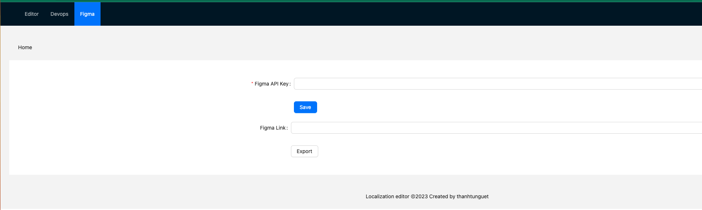

Anh chị paste API Key vừa tạo vào ô tương ứng và click "Save"

### Xuất dữ liệu cho một file cụ thể

Sau khi đã cài đặt API key, anh chị chỉ cần copy link file Figma tương ứng (Lưu ý rằng tài khoản mà anh chị dùng để tạo API key cần phải có quyền truy cập tới file đó), dán link file vào ô tương ứng và nhấn Export:

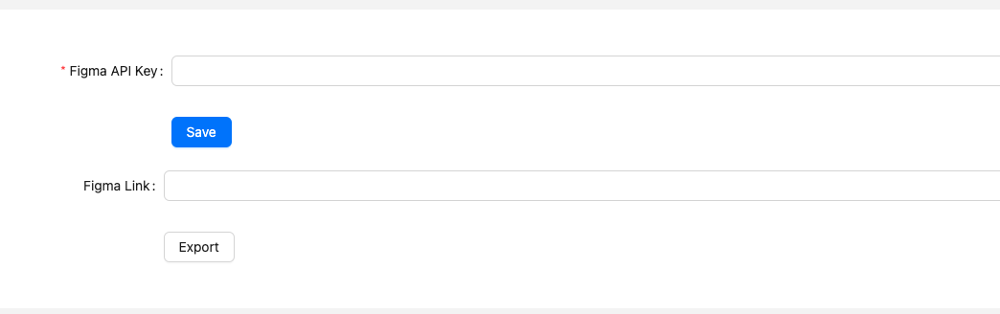

Hiện tại, ứng dụng sẽ xuất tất cả các text node trong Figma ra code. Công cụ đang được tiếp tục nghiên cứu để cải tiến tính năng này để phân loại các text node giúp code xuất ra được tinh gọn hơn và chỉ chứa các label node, không chứa các data node.

Định nghĩa:

- label node là những dòng text hiển thị trên màn hình mà không / hoặc rất ít (chỉ phụ thuộc vào trạng thái) của dữ liệu.
  Ví dụ: Sản phẩm, vật tư, đơn hàng, khách hàng, ...
  Trạng thái của dữ liệu là các thuộc tính của dữ liệu mà không phải giá trị, ví dụ: số ít / số nhiều, có dữ liệu / bị trống, ...

- data node là dữ liệu được hiển thị dưới dạng text. Ví dụ: ngày/giờ, tên của khách hàng, mã đơn hàng, ...

## Chỉnh sửa file ngôn ngữ trực tiếp trên web

Để chỉnh sửa file ngôn ngữ trên web, anh chị click vào extension, chọn tab "Editor"

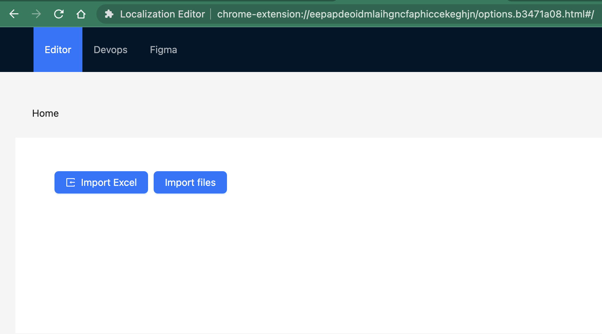

Ở màn hình này, có 2 chức năng:

- Import Excel: import nội dung ngôn ngữ từ file excel. File excel có thể là file được xuất ra từ editor này hoặc theo template sau:

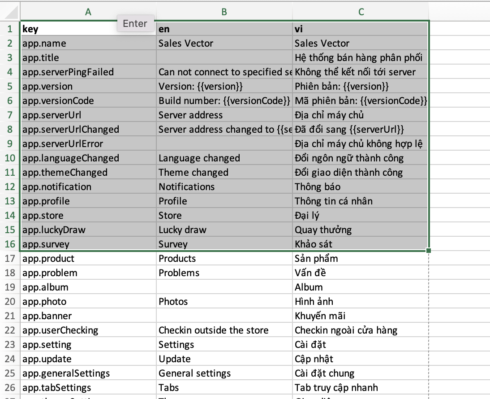

- Import files: chọn thư mục chứa code ngôn ngữ.

Đối với React project (bao gồm cả React Native): `src/i18n`

Đối với Flutter project: `lib/l10n`

Sau khi import được dữ liệu ngôn ngữ, anh chị sẽ có màn hình sau:

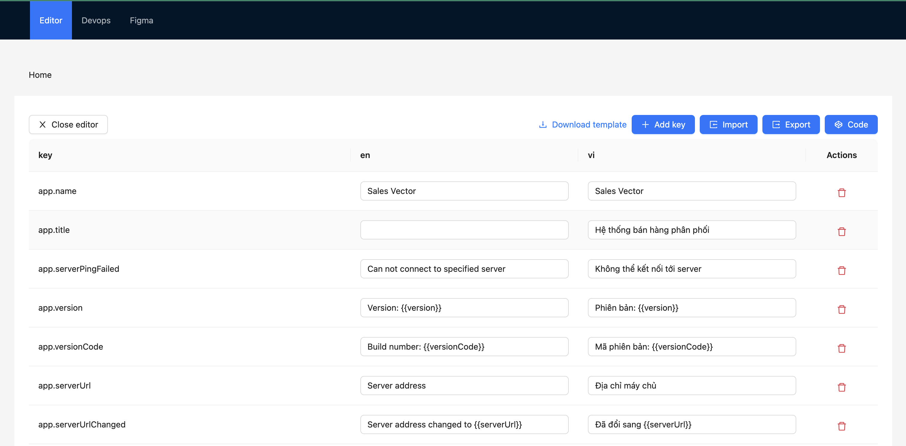

Tại đây, anh chị có thể chỉnh sửa trực tiếp nội dung các dòng text theo từng ngôn ngữ hiển thị.

Công cụ hỗ trợ các chức năng sau:

- Add Key: Thêm một key mới

- Import: Import một file excel mới

- Export: Xuất dữ liệu ra file excel

- Code: Xem dữ liệu được xuất ra dưới dạng JSON (chủ yếu dành cho dev). Tại view này, anh chị có thể tải về file `json` hoặc `arb` tương ứng với ngôn ngữ và loại dự án.

- Save: Nếu anh/chị đang chỉnh sửa file từ Azure Devops, nút Save sẽ có tác dụng lưu lại toàn bộ nội dung chỉnh sửa lên Azure Devops.

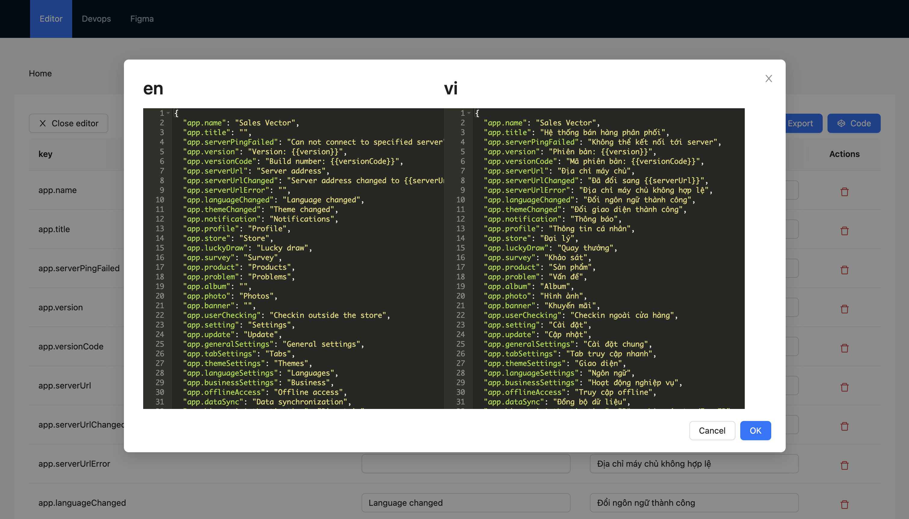

- Xóa key (icon thùng rác màu đỏ): Xóa key tại dòng được chọn

## Quản lý server Azure Devops

Anh chị chọn Tab Devops:

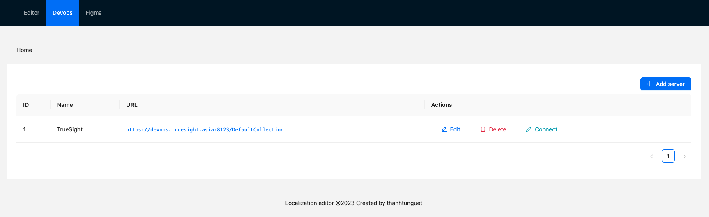

Tại đây, anh chị có thể quản lý danh sách Azure Devops Server mà anh chị có quyền truy cập.

Khi thêm server, anh chị cần nhập các thông tin sau:

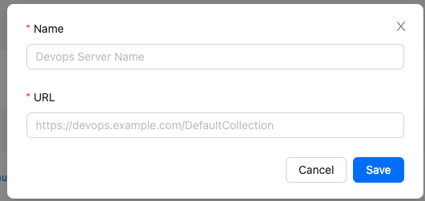

- Name: Tên gợi nhớ, có thể là tên công ty, đội nhóm sở hữu Server này
- URL: Địa chỉ server này. Lưu ý: chọn cả đuôi /DefaultCollection
  Đối với Azure Devops Cloud, sẽ là URL của organization

## Mở Repo trên Azure Devops

Anh chị có thể mở trực tiếp nội dung các file ngôn ngữ từ một Repo trên Server Azure Devops chỉ định.

Tại màn hình Devops, anh chị chọn server mong muốn và nhấn Connect:

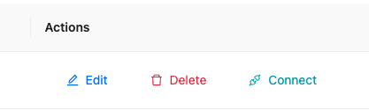

Lưu ý: anh chị cần đăng nhập vào server này trước, để trình duyệt có thể sử dụng cookie truy cập vào danh sách project/repos.

Khi popup Connect mở ra, anh chị lựa chọn các thông tin dự án:

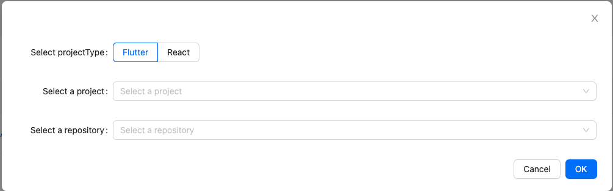

Trong đó:

- ProjectType: Loại dự án: Flutter hoặc React.

Nếu các anh chị BA dùng công cụ này, hãy liên hệ với dev quản lý repo tương ứng để biết thông tin project/repo/công nghệ sử dụng.

Sau khi chọn đúng các thông tin, anh chị nhấn OK. Công cụ sẽ tải các file ngôn ngữ trong mã nguồn của project được chọn để mở editor chỉnh sửa.

Tại chế độ chỉnh sửa online, anh chị có thể nhấn Save để lưu nội dung ngược lại Azure Devops. Tính năng này sẽ rất tiện để anh chị có thể cập nhật trực tiếp nội dung text hiển thị lên Azure Devops và build bản mới nếu đã thiết lập CI/CD trước đó.

## Đang cập nhật

Công cụ này vẫn đang được phát triển tiếp với các định hướng sau:

- Phân tách được label và data node từ Figma

=> Cần quy tắc hóa thiết kế Figma như thế nào?

Công cụ được phát triển với mục đích hỗ trợ anh chị trong quá trình phát triển, tiết kiệm công sức và tăng hiệu quả / độ chính xác khi xây dựng phần mềm. Vì vậy, rất mong anh/chị tham gia sử dụng và đóng góp ý kiến cũng như ý tưởng để phát triển và cải thiện.
